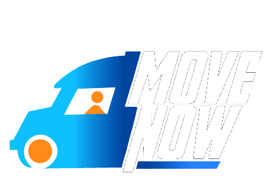
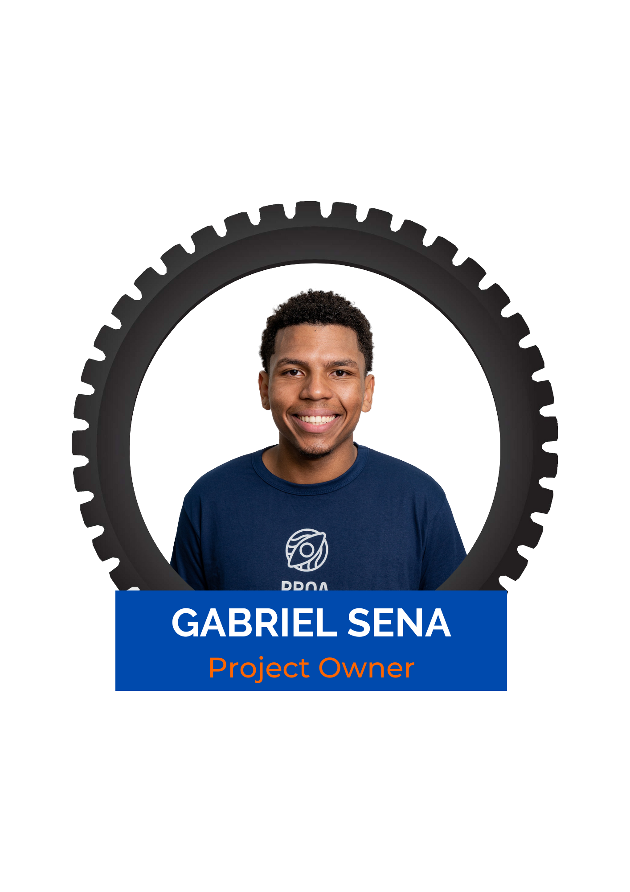
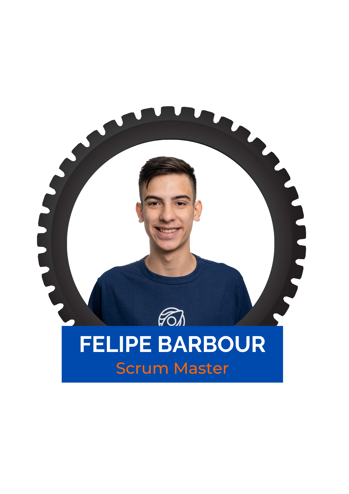
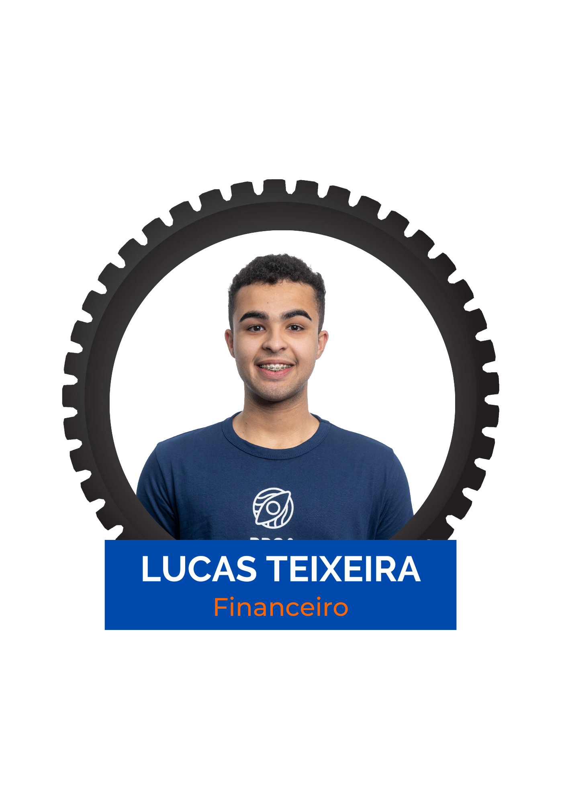
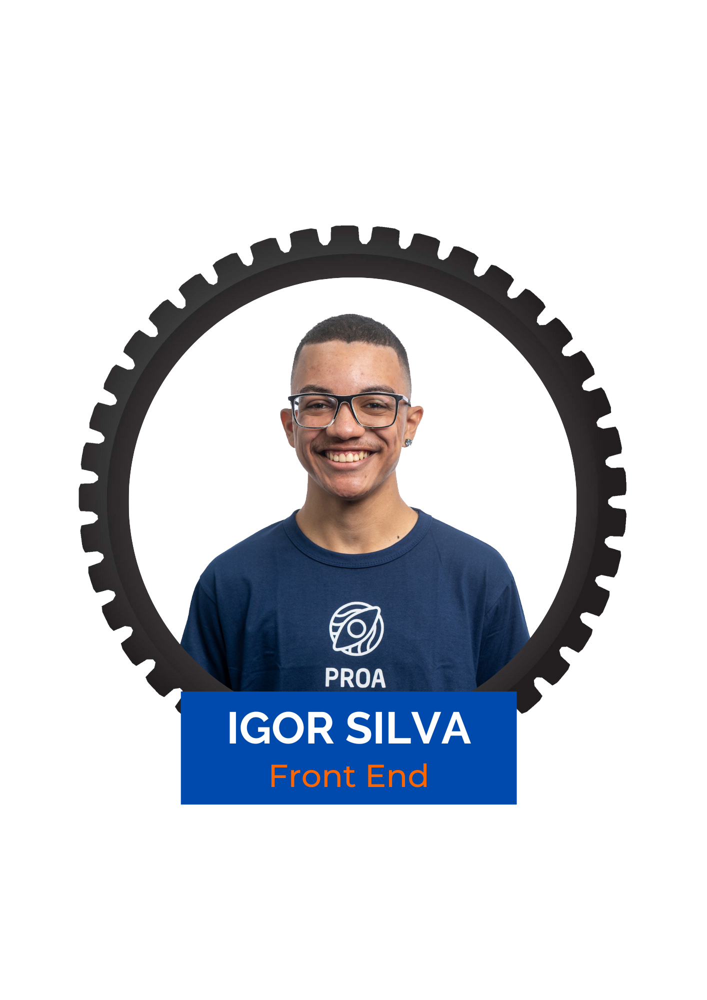
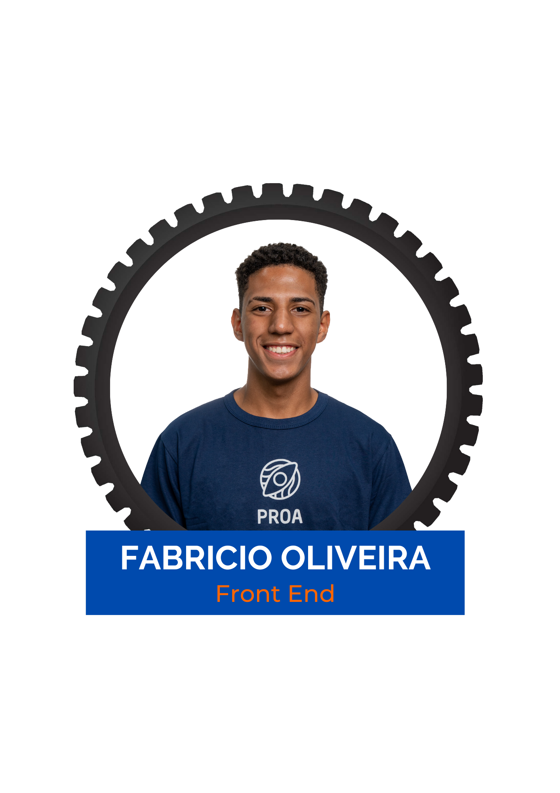
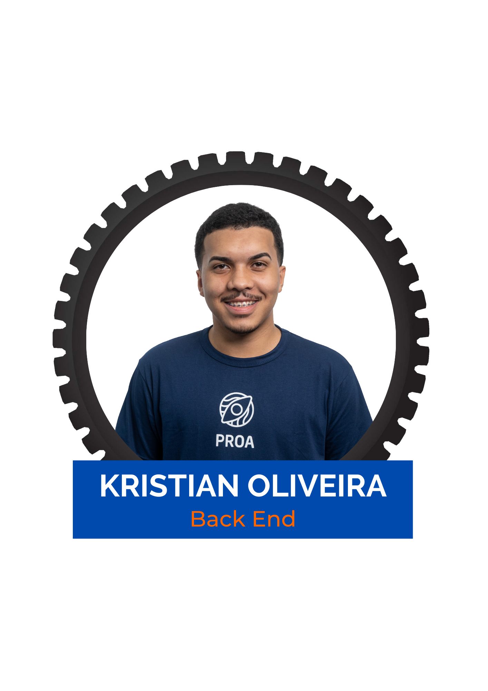
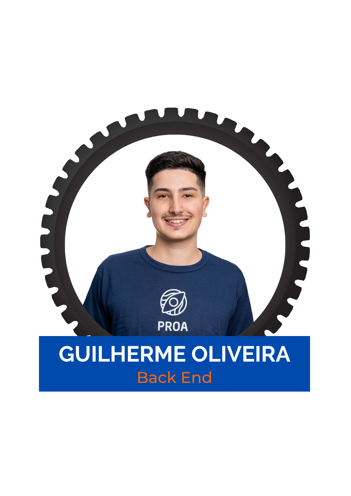

 

 

MoveNow é uma empresa que vem ao mercado proporcionar melhores opções de carretos, de acordo com a sustentabilidade do meio ambiente, a segurança, e trazer um contato pessoal entre o prestador de serviços e o cliente. Logo, gerando oportunidades para pessoas que se encontram desempregas e necessitam dessa atenção.

##

<h3 align="center"> 📌 Missão</h3>

A missão da MoveNow é proporcionar opções de carretos sustentáveis e seguros, ao mesmo tempo em que promove o contato pessoal entre prestadores de serviços e clientes. Buscamos gerar oportunidades para pessoas desempregadas, valorizando a inclusão e a atenção às necessidades dos clientes.

<h3 align="center"> 👀 Visão</h3>

 Nossa visão é ser a principal plataforma de serviços de carreto, reconhecida pela excelência em oferecer soluções que promovam a inclusão, a confiança e a sustentabilidade ambiental. Queremos transformar a percepção do público em relação à carretagem, tornando-a uma opção desejada e confiável.

<h3 align="center"> 🏅 Valores</h3>

Inclusão: Acreditamos na importância de incluir e oferecer o serviço à todos, promovendo a diversidade e a igualdade de oportunidades.
 
Confiança: Valorizamos a construção de relações de confiança entre prestadores de serviços e clientes, garantindo segurança e tranquilidade durante os carretos. 
 
Sustentabilidade: Comprometemo-nos com práticas sustentáveis, buscando reduzir o impacto ambiental por meio de opções de carretos mais ecológicas e conscientizando nossos usuários sobre a importância da preservação do meio ambiente.
 
Atendimento personalizado: Valorizamos o contato pessoal entre prestadores de serviços e clientes, proporcionando uma experiência personalizada e atenta às necessidades individuais.
 
Transparência: Promovemos a transparência em nossas operações, fornecendo informações claras sobre os serviços, taxas e processos envolvidos nos carretos.

##

<h3 align="center"> 💻 Tecnologias</h3>
 

  
<h4> ➡️🔚 Front-end<h4>
  
  
  
  
  

  
<h4> ⬅️🔚 Back-end<h4>
  
  
  

  
<h4> 🎲 Banco de dados<h4>
  
   
 <h4> 🔧 Ferramentas<h4>
  
   
   
   
    

 
 

##

<h3 align="center"> ⏫ Sobre nós</h3>
 

O empreendedorismo periférico é um dos braços do empreendedorismo, sendo um dos principais responsáveis por girar a economia brasileira, afinal, as favelas brasileiras movimentam por ano, aproximadamente R$ 120 bilhões, então a Inovalem surge como uma plataforma focada em incentivar esses empreendedores e empreendedoras a buscar o melhor caminho para gerirem e impulsionarem seus negócios.

##

<h3 align="center"> 🦾 Nossa equipe</h3>

 

##

<h3 align="center"> 📢 Fale conosco</h3>
 

